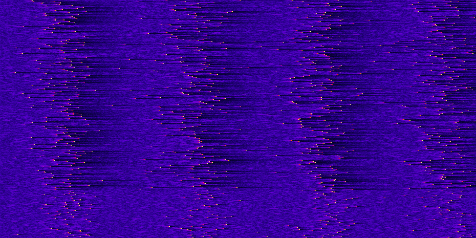

# Blue Shell

Implementation of a spiking neural network. Uses neurons described by Eugene Izhikevich in:

E. M. Izhikevich, "Simple model of spiking neurons," in IEEE Transactions on Neural Networks, vol. 14, no. 6, pp. 1569-1572, Nov. 2003, doi: 10.1109/TNN.2003.820440.

## Other resources

This repo is for demo/educational purposes. If you haven't already, check out the more fully-featured spiking net simulators for Python that already exist. Some good places to start are [BindsNET](https://github.com/BindsNET/bindsnet) and [Brian](https://briansimulator.org/).
