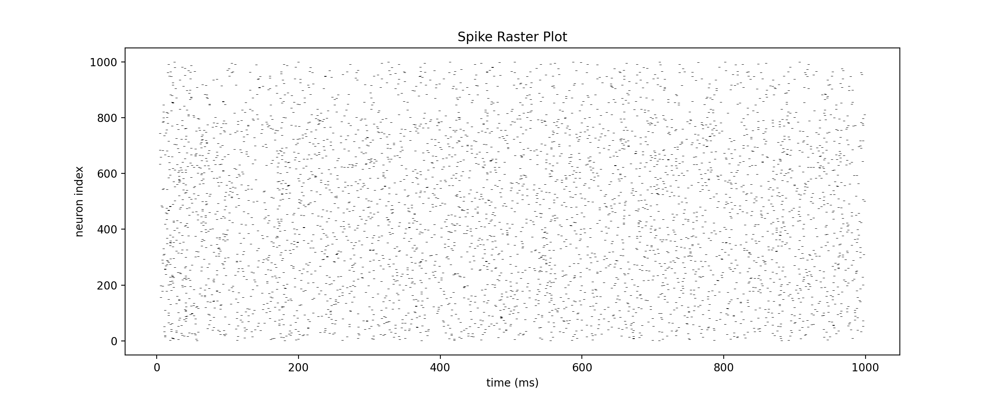

# Blue Shell

This is a small demo of how easy it is to implement an efficient, biologically plausible spiking neural network in a few lines of Python.

## Background

The meat and potatoes of this code is based on the work of Eugene Izhikevich. Specifically this paper:

E. M. Izhikevich, "Simple model of spiking neurons," in IEEE Transactions on Neural Networks, vol. 14, no. 6, pp. 1569-1572, Nov. 2003, doi: 10.1109/TNN.2003.820440.

The code was originally written for MATLAB. I have only modified it slightly for Python.

You might look at this code and wonder, "hey, what are these variables 'a', 'b', 'c', and 'd'? What is happening here?"

Well, to answer that, I highly recommend reading the original paper, which explains what these variables are, and how the default values were chosen. The crux of it is that Izhikevich effectively reduced the dynamics of neural activity to just two equations. By modifying the different parameters, it is possible to replicate all sorts of neuronal dynamics (e.g. chattering, bursting, regular spiking, low-threshold spiking, and fast spiking). Pretty impressive, considering how compact the equations are and that only one term is non-linear.

It's really a beautifully simple model. Computationally, it's also super efficient. As the abstract of the original paper says: "Using this model, one can simulate tens of thousands of spiking cortical neurons in real time (1 ms resolution) using a desktop PC."

## How to run

Presently there is only one script (blueshell.py). You can run the script directly to do a simple test. The script defines a single class, which is the IzhikevichPool. The typical usage would be to create a pool instance, and repeatedly call the pool's update() method to run the simulation. At any time you can clamp external inputs by using the clamp_input() method.

You can also generate a quick raster plot by calling plot_spikes(). You'll see something like this:

## Other resources

This repo is for demo/educational purposes. If you haven't already, check out the more fully-featured spiking net simulators for Python that already exist. Some good places to start are [BindsNET](https://github.com/BindsNET/bindsnet) and [Brian](https://briansimulator.org/).
